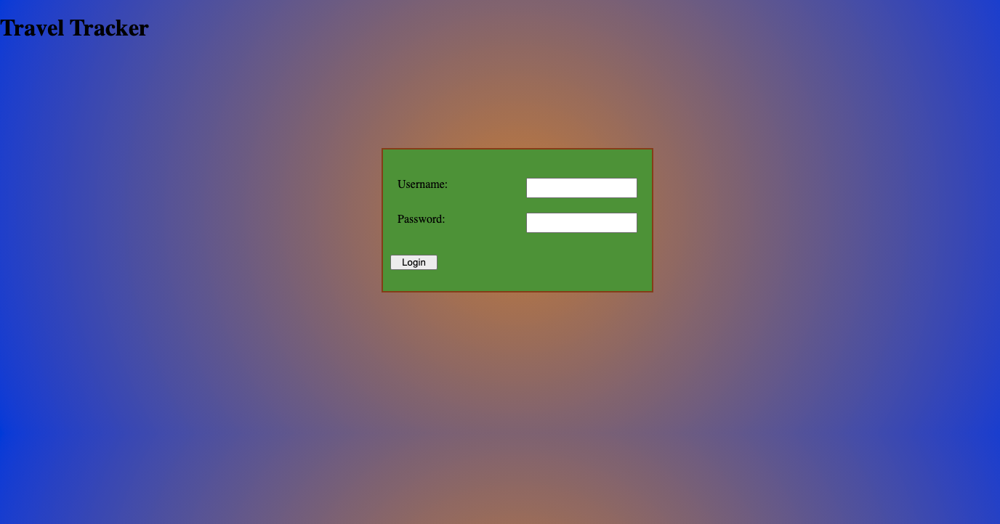
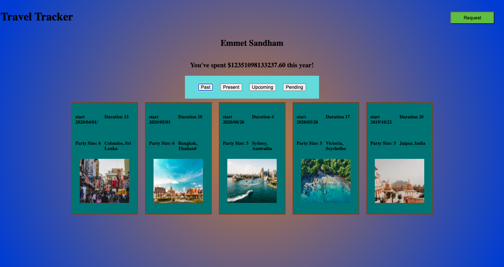
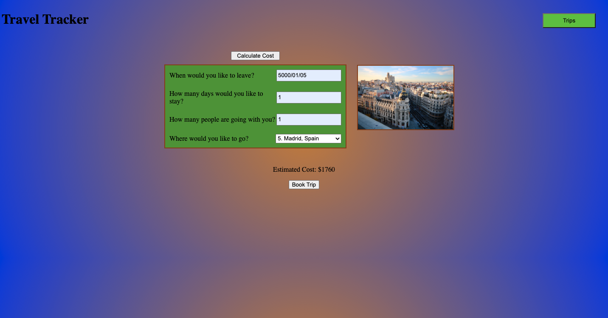

# Travel Tracker

A project by Ian Holladay

## Link to the project's github page
https://github.com/holladayian/travel-tracker-ih

## About

Thius project was designed to help us get a handle on fetch, webpack, and spies, along with previous lessons such as testing and object inheritance.

## What it does

The site should be able to log a user in, show them their trip data, and let them make requests for new trips

## Rubric
- Use OOP to drive the design of the application and the code
- Work with an API to send and receive data
- Solidify the code review process
- Create a robust test suite that thoroughly tests all functionality of a client-side application

## Technologies
- fetch API to retrieve and add data
- Sass for getting fancy with your CSS
- Mocha and Chai for testing your code

## Images

This is an image of the log in page

This is an image of where the trips will be shown

This is an image of the request page

## Tag

You can find me on github 

@holladayian

